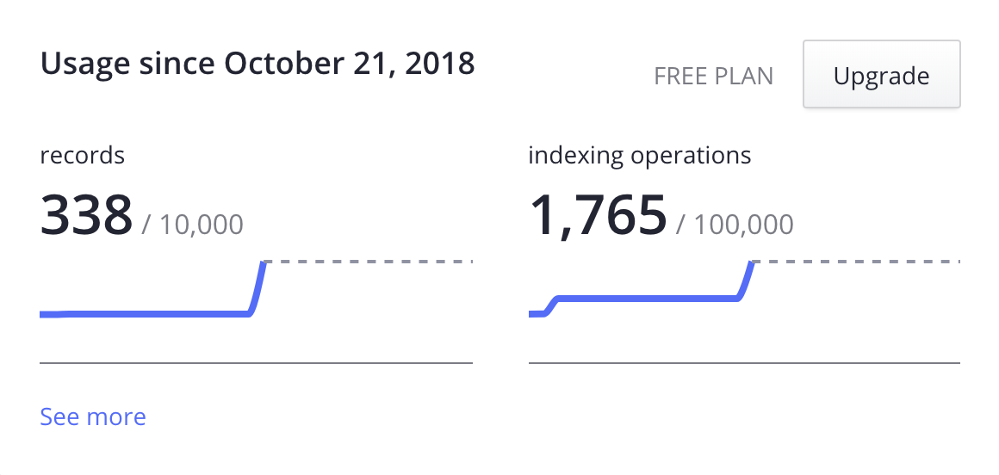

# Implementing Algolia Search

#Practical #Blog #Meta #JS

_For a new site update I have implemented a site-wide search, and in this article, I would write about the solution I have used for this, as well as would talk about what had to be done and what issues are left._

Some time ago I have started to notice that a lot of sites[^sites] with open source documentation have a very nice full-text search implemented. As most of those sites were static-generated, I was interested to see how it was done, so I decided to dig deeper into it, in case I'll need something like that for one of my projects.

[^sites]: For example, [Hugo](https://gohugo.io), [Netlify](https://www.netlify.com), [React](https://reactjs.org) and others.

The project that allowed those static sites to have search was [Algolia DocSearch](https://docsearch.algolia.com/). However, in this post, I won't talk about it. Looking at the project's site, I found out that it is very easy to use it for your open source project for free, but I wanted to have more challenge, so I looked into what Algolia provides for regular sites.

Basically, they provide a free tier with rather loose limitations[^free-plan-rates-link], so it is totally possible to implement it for your project. That's what I've done for my site, and in this post, I'll describe how I did it and what challenges were there.

[^free-plan-rates-link]: See the [“free plan rates”](#free-plan-rates) section of this post.

## The Search Itself

In order for you not to go elsewhere, you can try and use the search right away[^issues] — just press this emoji button: {}


  [^issues]: There are a bunch of issues with my implementation, as I didn't refine everything and implemented everything rather fast, as a kinda proof of concept. I'll cover [most of the issues](#known-issues) later in the article.

  [^query]: So, when using this page, it is possible to have a link to the results, for example, a search page for [“search”](/search/?query=search).


{}

Note how almost every page of this site has this button both in the header and footer. There is also a separate [search page](/search/), where the form is always shown (and the query[^query] is always added to the URL).

## Implementing the Search

The project that I've used to achieve this is called [InstantSearch.js](https://github.com/algolia/instantsearch). The main difference from the DocSearch that I see there (apart from the usage conditions etc.) is that you don't get the DocSearch's UI. This is because docs often have their own data structure, and the indexing for DocSearch is made on the Algolia side via a crawler, so they can prepare everything for the UI right away. But InstantSearch is a general solution, it doesn't know anything about the site you'll use it for, and so you need to set up everything almost from scratch.

Everything you need to do can be described as the following parts:

1. [Infrastructure](#infrastructure) — signing up for the service itself, setting up the index, the build steps at netlify, etc.
2. [Indexing](#indexing) — setting up the creation of the `algolia.json` which would be sent then to Algolia for indexing.
3. [Design](#design) — the hardest part: where to place the search, how the results should look, what interactions you'd want.
4. [Front-end implementation](#front-end-implementation) — all the JS and CSS needed for your search to work.

The infrastructure part took me one just evening (with some basic indexing as well), and everything else I did occasionally when I had some free time over a span of a few weeks, but most of the time I have spent thinking about the design decisions. I imagine, if you'd have some design for your search ready, this would go much faster, after getting familiar with the InstantSearch's API everything I wanted to do was rather easy to implement.

### Infrastructure

I didn't expect this, but setting everything up was the easiest part. For signing up you can use GitHub or Google accounts, everything went rather smoothly for me, so I'm not even sure what to write there?

The part that was _slightly_ harder was setting up the build step for sending my index (that I would create in the next step) to Algolia. I have used the [atomic-algolia](https://www.npmjs.com/package/atomic-algolia) package — it is really nice as it allows you to send only parts of your index that were changed, so you won't exhaust much the quota in your plan.

All you need for this package to work (other than the `algolia.json` which would be generated later) are some environment variables. The best way to handle those locally is via `.env` file, for me, it is something like this[^privacy]:

[^privacy]: Do not forget to add your `.env` to the `.gitignore`! The admin key is a secret one, so you won't want for it to be committed. <!-- offset="3" span="3" -->

#### `.env`

``` ENV
ALGOLIA_APP_ID=SOMEID
ALGOLIA_ADMIN_KEY=SOMESECRETKEY
ALGOLIA_INDEX_NAME=kizu.ru
ALGOLIA_INDEX_FILE=out/algolia.json
```

Then, you'd want to have an npm command to send your index to algolia, in my case it is something like that inside `package.json`:

``` JS
{
  "scripts": {
    "algolia": "atomic-algolia"
  }
}
```

However, you wouldn't want to run this command _every time you do changes_, so I didn't add it to my gulp's `watch` or `build` commands. Locally, I only run this command manually[^dev-index] whenever I want to test how the indexing would work, so automation-wise, I've added it only as a part of a production build at my `netlify.toml`:

[^dev-index]: For my site that is enough, but for a more serious project, you would probably want to set up a development copy of your index, where you could test things without touching your production index. <!-- span="2" offset="2" -->

``` TOML
[context.production]
  command = "HUGO_BASEURL=$URL gulp build && npm run algolia"
```

This command would run only when I would make changes that would go into a production version of my site. And unless I'll want to test some stuff, I won't ever need to run this command manually, this way my search index would always be synchronized with the production, even if the changes would be made via a pull request at GitHub, for example.

As I'm building everything at Netlify, I also need to have my [environment variables](https://www.netlify.com/docs/continuous-deployment/#build-environment-variables) there, I'm doing it via dashboard, and it is probably the best way, as you probably do not want to have your secret keys in your `netlify.toml`, though you could use it for the more public variables, like in case you'd want to push to different indices for different versions of your site.

### Indexing

While the _indexing_ itself would be done at Algolia side, we still need to provide the data for it. As it is not a DocSearch, there is no crawler, and we need to set up all the data we need to be indexed as a `.json` file that we would provide as an `ALGOLIA_INDEX_FILE` environment variable for the `atomic-algolia` package.

Each site is different, and there are a lot of ways to set up this JSON. Here is [an Algolia doc on formatting your index data](https://www.algolia.com/doc/guides/indexing/structuring-your-data/) I've used[^forestry-guide], but, basically, the only requirement for this file is that it should be an array of uniform objects. There are even no required fields! However, I'll recommend you to always have unique `objectID` keys, as they're used for the atomic updates via `atomic-algolia`, but otherwise, you can choose how to structure your data.

[^forestry-guide]: I have also used some bits of this [handy forestry guide](https://forestry.io/blog/search-with-algolia-in-hugo/); even as I don't use Forestry, but use Hugo, most of this guide applied to me as well. <!-- offset="1" -->

#### Splitting Into Multiple Records

The only real requirement for the free tier is that each item shouldn't be larger than 10kb. As I'm indexing almost everything[^almost-everything], in order to have a full-text search I split every blog post into different records. This is totally ok and [is even recommended](https://www.algolia.com/doc/guides/indexing/structuring-your-data/?language=instantsearchjs#indexing-long-documents). I'm splitting by subheaders, but you can split even by paragraphs — this way the search would be more relevant, but it would take more records (and would be a bit harder to set up).

[^almost-everything]: I'm not _yet_ indexing code blocks or examples, but planning to. <!-- offset="1" -->

After splitting everything, it is possible then to merge[^distinct] everything by some unique attribute, I'm doing it by `title`, this way in the search results you'd get only one the most relevant record for a single post. It is also possible not to do this, as you can do this manually on the client side, allowing you to implement some interesting effects, but I didn't yet get to do this.

[^distinct]: Via a “distinct” concept, you can read about this at the [corresponding docs page](https://www.algolia.com/doc/guides/ranking/distinct/).

#### Generating Fields

There can be a lot of ways to generate the needed JSON, if you're using just Hugo, for example, it can be harder, as you'll need to set this up just using its template engine (which is far from perfect and usable), but as I'm [preparing everything in gulp]({}#engine), I can make it much easier, preparing some extra metadata just for the search index for each post, and then in Hugo I would need to do much fewer things.

I would omit the code for generating everything, but I'll describe the fields I have decided to include in my `algolia.json`.

##### The Fields

As I'm splitting each post into multiple entries, a lot of the fields would be the same for such records:

- `title` — the entry's title, the key which is used for merging multiple records into one entry.
- `date` — the post's date in a form of a Unix timestamp.
- `publishdate` — the post's date in a human-readable format, in case I'd want to display it or search by it.
- `permalink` — the entry's full permalink (not yet used anywhere, but could be useful later).
- `relpermalink` — the entry's permalink, relative to the site's root (I'm using it instead of a `permalink` so the links at the search results would be proper in development as well).
- `summary` — the entry's summary field.
- `tags` — an array of the tags applied to the entry.
- `type` — the type of entry — for now it is either `post` or `page`. Some entry types can have null for some of the other fields like pages do not have dates.
- `lang` — the language of the entry, it is either `en` or `ru` for my site, used for faceting later.

Some other attributes are more unique per record, and are based on how I split the entries:

- `objectID` — unique ID, a sum of the entry's `.UniqueID` prop in Hugo and the part's hash.
- `subtitle` — if the part has a subtitle, it goes into this field.
- `hash` — optional hash of the subtitle, used for having more precise links to the headers' anchors.
- `content` — if the part has some content, it goes there (the first record of an entry often does not have it, so when we display it, we use `summary`).
- `order` — the index of the entry's part after splitting.

This is probably far from the perfect structure, and I'm not yet sure all the fields are needed, but for now, it seems to work for me.

#### Ranking and Faceting

There are a lot of things you can set up in the Algolia dashboard for your index.

There is [“Faceting”](https://www.algolia.com/doc/guides/searching/faceting/) — you can use it to narrow down results. Right now I'm using it only to differentiate between languages, but maybe in the future, I'll implement a more advanced search form, so could add more facets like `type` and `tags`.

Then, there is [“Ranking”](https://www.algolia.com/doc/guides/ranking/ranking-formula/) — Algolia has a lot of built-in ranking stuff going on under the hood, but it also provides you with some ways you can have an influence on it. The basics are just the order of all the searchable attributes and some ranking criteria for sorting the hits when everything else would be ranked the same.

#### Free Plan Rates

Free tier includes a bunch of available records & indexing operations, reset monthly, as well as an obligatory display of their logo) — totally enough for a personal site, for example. Here is a screenshot of my usage stats at the moment of writing this article:



Note that all those operations are including all the testing I've done and changes to the data, so in actual usage, there would be much fewer operations per month.

[Paid plans](https://www.algolia.com/pricing) provide much better rates, and the essential plan is free for open source projects, but the free community tier is totally enough for me and would be enough for most of the smaller sites.

### Design

I'm not a designer, so most of the things I'm doing design-wise are iterative and based on what I already have. However, I found that for implementing search the design is the most complex thing, mostly because a lot of other decisions come from deciding what and how you want to display as your search results. The only thing that design does not really impact — infrastructure, but how you set up the indexing, and how you would then implement it all come from the design decisions.

When coming up with the design for the search at my site, I had to answer the following questions:

- Where to place the search? Footer? Header? On which pages?
- How the search form should look? Should it be displayed from the start, or hidden beyond a button?
- How the search results should look? What to include there? In which cases? (The hardest part, probably)
- What interactions should I have? Keyboard nav? What else?

I'm sure I forgot a lot of things there, and I'm sure there are a lot of things to improve. What I have now is basically a “good enough” proof of concept.

### Front-end Implementation

I won't describe each and every nuance[^changes] that there was in my implementation, but there are some notes about what I have done, maybe someday later I'll write more about something from there:

[^changes]: You can go through [all the changes related to search](https://github.com/kizu/kizu.ru/pull/212/files) at my GitHub if you want, but the code can be a bit messy.

- I did not use the provided CSS styles for the InstantSearch, because all the CSS for my site is [extremely experimental]({}#new-extremely-experimental-css), and I wanted for it to be in the same vein.
- As the mustache[^mustache] templates used for everything are not very powerful, I had to prepare the data I recieve from the Algolia, that was easy enough via a `transformData` hook at the [hits widget](https://community.algolia.com/instantsearch.js/v2/widgets/hits.html).
- I do not load the search by default (except for the [dedicated search page](/search/)), at least, not all of it. So visitors of my site wouldn't need to load the InstantSearch.js from the CDN unless they would request the search.
- While it is possible to have multiple search forms and results on a page, I have decided to have only one open at each moment.
- The search button toggle is actually a link to the dedicated search page, so the search can be opened at a new browser tab if needed.
- A search form is actually a form, and while I override the submit and do everything on each `onInput`, the form's action also leads to this dedicated search page, so if you'll manage to submit it natively, things would still kinda work.
- There is some limited keyboard navigation inside: both tab-based and with up/down arrows.
- I've implemented some kind of an HTML&CSS-only display of the highlighted parts in the content results, but it looks a bit bad on the left side, where there is no ellipsis on text overflow. This is probably the hardest part of both the design and implementation — how to show the found context, how to strip what is not needed etc. I would totally continue working on this in the future.

[^mustache]: InstantSearch uses [mustache](https://mustache.github.io/mustache.5.html) in its native JS variant, but there are also implementations of InstantSearch for React, Vue.js etc. as well. <!-- offset="3" -->

There is a lot of stuff going on behind the scenes, but most of it was kind easy to implement. InstantSearch API is rather nice.

## Known Issues

As I've already said — right now this search form on my site is mostly proof of concept. I already know about a lot of issues that I want to fix. The most prominent are:

- There is no scrolling help when you use keyboard nav (and when the results are added behind the visible part of the viewport).
- The content snippet presentation is far from perfect, right now it is mostly done in CSS, but I think I'd need to truncate it more via JS as well.
- It would be nice to have better navigation inside each post, right now there is only one result per entry, but with the split records, it should be possible to implement it much better I think.
- The code blocks and the code of the examples is not yet indexed. Each one would probably need its own record.
- There are a lot of ways the search can be expanded via new facets etc., right now it is very simple.

## Overall Thoughts

Making the search to behave properly in a no means an easy task. I've implemented just a glimpse of what a good site search should have, but for now I'll consider it “good enough” — it mostly works, and I don't want to spend more time on it at the moment. I would try to refine it in the future, but for now, I'm already happy with it.

There are things that could be improved in the InstantSearch, like built-in tools for working with keyboard navigation, more semantic initial templates, some other minor quality of life improvements. But overall I was impressed with what they provide, especially at the infrastructure side. And it works really, really fast.

So, now my site now has a built-in search. I do not have a lot of content, but maybe I could now find my own articles when I need them a bit easier. And if you'd want to have a search form for your site, you could try this solution as well.
