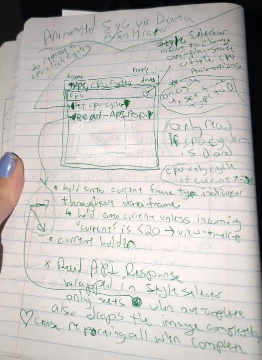
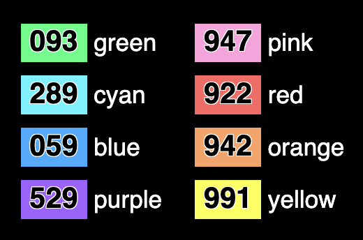
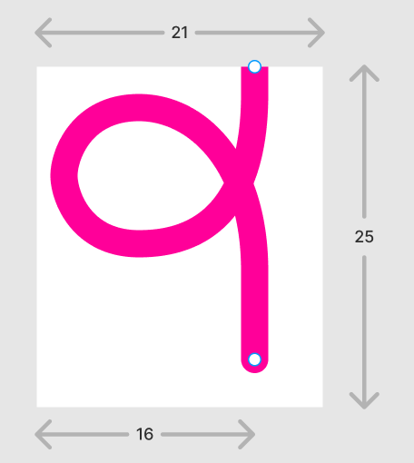

# Passing Data into SVG: Linked Parameters Workaround

#CSS_Variables #SVG #Experiment #CSS

_Twelve years ago, I started a draft for an article. I never published it: there were a few cross-browser issues, and the idea was raw and unpolished. I have many drafts like this in my archives. Sometimes, something new interacts with one of these older ideas and leads to something interesting. This article is about one such case: a hacky technique that allows us to pass some data from CSS to SVG and use it to adjust colors or almost anything else._

## The Spec

In the title I mentioned [“Linked Parameters”](https://drafts.csswg.org/css-link-params-1/) — it is the name of one of CSS Working Group’s “Editor’s Draft” of a spec, with [Tab Atkins-Bittner](https://xanthir.com/), [Daniel Holbert](https://github.com/dholbert), and [Jonathan Watt](https://jwatt.org/) as editors.

Let me quote from its abstract:

> This spec introduces a way to pass CSS values into linked resources, such as SVG images, so that they can be used as CSS custom property values in the destination resource. This allows easy reuse of “templated” SVG images, which can be adapted to a site’s theme color, etc. easily, without having to modify the source SVG.

<aside style="--offset: 0.5; --span: 3  ">

This spec proposes a few ways to pass these linked parameters into an SVG. The one I like the most is via a new [`link-parameters` property](https://drafts.csswg.org/css-link-params-1/#link-param-prop) which could look like this:

```CSS
.icon {
  link-parameters:
    param(--background, pink)
    param(--accent, var(--accent))
  ;
}
```

This defines the `--background` and `--accent` for the external SVG, to be applied either in HTML: `` or in CSS: `background: url ('icon.svg')`. How wonderful it would be to have this!

</aside>

Unlike many other SVG-related specs, this one is relatively new (from 2023), but, as with almost anything related to SVG, browsers are not rushing to implement (or, at least, prototype) it. This is a shame, as that problem — passing data into SVG from CSS — would be infinitely useful. Yes, it is possible to dynamically apply CSS to SVG when it is present inside the HTML document itself, but when we use an SVG as an `` or inside `url()` in CSS, we don’t have fine control over what is displayed there. Yes, we now have [fragment identifiers](https://caniuse.com/svg-fragment), but that’s it.

We cannot pass just some random color into an SVG if we want to change it, and have to rely on hacks involving masks or filters.

But what if we had… another hack, but this time more powerful?

## The Workaround Technique

How can an SVG know anything about its context if we are not using fragment identifiers?

The answer is in the “S” of SVG, which stands for “Scalable”.

When we use an SVG in our document, we can define some dimensions: `width` and `height`. And that SVG can then _scale_, _respond_, and _adapt_ to them.

Long story short: we can[^limitations] encode some information for an SVG as its dimensions, using them as the channel of communication with the SVG’s content!

[^limitations]: This technique has many limitations: do not expect it to be universal. It is experimental, and it is a workaround. <!-- span="3" -->

Look at these (and hover/focus them):

<figure style="display: flex; flex-wrap: wrap; justify-content: space-between;">
  <a
    href="https://github.com/CSS-Next/logo.css"
    target="_blank"
    class="icon restore-visuals"
    aria-label="CSS Logo"
  ></a>
  <a
    href="https://github.com/CSS-Next/logo.css"
    target="_blank"
    class="icon"
    aria-label="CSS Logo"
    style="--r: 0; --g: 0; --b: 0"
  ></a>
  <a
    href="https://github.com/CSS-Next/logo.css"
    target="_blank"
    class="icon"
    aria-label="CSS Logo"
    style="--r: 9; --g: 14; --b: 9"
  ></a>
  <a
    href="https://github.com/CSS-Next/logo.css"
    target="_blank"
    class="icon"
    aria-label="CSS Logo"
    style="--r: 15; --g: 11; --b: 12"
  ></a>
  <a
    href="https://github.com/CSS-Next/logo.css"
    target="_blank"
    class="icon restore-visuals"
    aria-label="CSS Logo"
    style="width: 32px;"
  ></a>
</figure>

This is the new [CSS logo](https://github.com/CSS-Next/logo.css) (with its modified code), added as an external background-image to multiple elements:

```CSS
background-image: url('./css-linked.svg');
```

There are no filters or masks, but we can see how it is possible to override both background and foreground colors, and there is even a “small” variation (note the spacing around “CSS” in it) — all without changing the `url()`!


### The Inspirations

Before I go to the details of [the technique’s implementation](#the-implementation), I need to mention a few of the main sources of inspiration that led me to it.

#### The Spark

My most recent experiments on this started from a random [Mastodon thread](https://mastodon.social/@spiralganglion/113921387566692673) by [Ivan Reese](https://ivanish.ca/) almost two months ago, in which he shared some work-in-progress bits of CSS with SVG inside. I’ll quote one of the challenges[^last-example] he had:

[^last-example]: My [last demo](#one-more-use-case-link-underlines) in this article solves this challenge, as well as a few others mentioned in that thread. <!-- offset="3" span="2" -->

> I’m trying to find a way to have them turn red on hover without using filter or mask or pseudo-elements.

Initially, I did not know if I could help with this: I remembered that there was [a spec for linked parameters](https://drafts.csswg.org/css-link-params-1/), but no browser implemented it; otherwise, it would be the best fit. [Fragment identifiers](https://caniuse.com/svg-fragment) could be a solution, but not a perfect one, as we’d have to hardcode the color inside.

The next morning, I woke up with a solution. Many puzzle pieces I was thinking about in the past weeks clicked together.

#### SVG Stacks

When thinking about fragment identifiers, I was contemplating the concept of “SVG Stacks”. I was unsure if they could help with this issue, but maybe? The first time I can remember learning about them was from the [“SVG Stacks”](https://simurai.com/blog/2012/04/02/svg-stacks) post by [Simurai](https://simurai.com/) back in 2012 about this technique he attributed to [Erik Dahlström](http://dahlström.net/).

<aside style="--span: 4;">
  <figure>
     and <g id='chart' class='icon'>, with the “chart” word highlighted." src="./svg-stacks.png" />
    <figcaption>
      Illustration from Simurai’s article, modified to have a slightly better contrast and with background matching the page.
    </figcaption>
  </figure>
</aside>

At the time, browser support was just not there, and it was one of those “cool tech for the future” articles.

When I was thinking about SVG stacks, I also remembered two related articles about them and similar techniques:

- [“How to work with SVG icons”](https://fvsch.com/svg-icons) article by [Florens Verschelde](https://fvsch.com/) from 2016 with many useful details about using SVG sprites.

- [“SVG sprites: old-school, modern, unknown, and forgotten”](https://pepelsbey.dev/articles/svg-sprites/) by [Vadim Makeev](https://pepelsbey.dev/) from 2022, about the history behind SVG sprites and a few nuances around them.

While these articles were not strictly related to my technique, I still want to highlight them, as I will use the fragment identifier in some of my examples — SVG stacks can work pretty well alongside my technique.

#### Clown Cars

Next, I remembered my unfinished draft for an article where I tried to implement SVG stacks with what we had then — something very close to the technique I will describe today. I never finished that article, but in my drafts I wrote about my main inspiration for it: [“How To Solve Adaptive Images In Responsive Web Design”](https://www.smashingmagazine.com/2013/06/clown-car-technique-solving-for-adaptive-images-in-responsive-web-design/) article by [Estelle Weyl](https://estelle.github.io/) from 2013. It was talking about the “Clown Car Technique”, where we could put multiple images of different sizes inside one SVG, and then use media queries to choose one based on the SVG’s dimensions.

<aside style="--span: 3;">
  <figure>
    <div style="resize: horizontal; overflow: hidden; width: max-content; max-width: 100%; padding-bottom: 16px; margin-bottom: -8px;">
      <object
        class="restore-visuals"
        role="img"
        aria-label="An illustration showing a clown. The exact clown shown is based on the image's dimensions"
        data="./clown_car.svg"
        type="image/svg+xml"
        width="300"
        height="329"
        style="display: block;"
      ></object>
    </div>
    <figcaption>
      Illustration from Estelle’s article. Breakpoints were modified to allow resizing the image on this article’s page (try it if you can).
    </figcaption>
  </figure>
</aside>

While media queries themselves can be powerful, they are not very convenient for the problem I wanted to solve. That’s where the next puzzle piece falls into place.

#### Exfiltration

This January, [Jane Ori](https://propjockey.io/about/) published her latest wild experiment: [“100% CSS: Fetch and Exfiltrate 512 bits of Server-Generated Data Embedded in an Animated SVG”](https://dev.to/janeori/100-css-fetch-and-exfiltrate-512-bits-of-server-generated-data-embedded-in-an-animated-svg-5aad), in which she managed to encode some information inside an SVG, read it in CSS by using that image as a `content: url()`, and then getting the container’s dimensions.

<aside style="--span: 4;">
  <figure>
    
    <figcaption>
      A photo of paper notes from Jane’s article, cropped to fit better here.
    </figcaption>
  </figure>
</aside>

I immediately understood that for my technique I’ll be doing something very similar, but in reverse and on a smaller scale: instead of having the data inside an SVG, and then reading it from CSS, I’ll encode the data in CSS, and then pass it inside an SVG via manipulating its dimensions!

After all, if we can use CSS inside SVG, and most of all the new greatness like `@property` and all the math functions work there as well — why not use it?

#### Colours

Most of the remaining puzzle pieces were my experiments with colors in CSS, [initiated](https://front-end.social/@kizu/113714092648709846) by my conversation with [Lea Verou](https://lea.verou.me/), and later followed up by my [“Splash Colour Mixin”](https://blog.kizu.dev/splash-colour-mixin/) post based on the [Splash](https://www.todepond.com/lab/splash/) colour format by [Lu Wilson](https://www.todepond.com/). In these experiments, I already played with many ways of encoding and decoding colors — something I would need to do for my technique.

<aside style="--span: 2;">
  <figure>
    
    <figcaption>
      A screenshot of an example from Lu’s article.
    </figcaption>
  </figure>
</aside>

#### Responsiveness

The final details were various techniques for working with the responsiveness of SVG. After all, in this technique, we _lose_ the dimensions of our SVGs, but we will still need to display the images inside, either in their original dimensions or properly scaled. That’s where [“Responsive SVGs”](https://12daysofweb.dev/2023/responsive-svgs/) article by [Nils Binder](https://ichimnetz.com/) from 2023 (published by [Stephanie Eckles](https://thinkdobecreate.com/) on her [12 Days of Web](https://12daysofweb.dev/) project) helped a lot.

<aside style="--span: 3;">
  <figure>
    
    <figcaption>
      An illustration from Nils’ article.
    </figcaption>
  </figure>
</aside>

And I cannot omit some other great resources that could help you understand how things work in SVG related to what I’ll be doing in my technique:

- [“Understanding SVG Coordinate Systems and Transformations (Part 1) — The `viewport`, `viewBox`, and `preserveAspectRatio`”](https://www.sarasoueidan.com/blog/svg-coordinate-systems/) by [Sara Soueidan](https://www.sarasoueidan.com/) from 2014 — a more theoretical in-depth guide for various aspects of SVG sizing.

- [“How to Scale SVG”](https://css-tricks.com/scale-svg/) by [Amelia Bellamy-Royds](https://github.com/AmeliaBR) from 2022 — a more recent, and more practical guide for various use cases for scaling SVGs.


### The Implementation

A usual **disclaimer**: this is highly experimental! The technique relies on adjusting the size of the SVG canvas, which can result in it being pretty large. If we use it for hundreds of icons on a page — I have no idea how browsers would behave. The technique also uses many newer CSS features. All together: I won’t recommend using it in production, unless you really know what you’re doing, and will test your code extensively.

#### The Core in CSS

The idea behind the technique is simple, but everything following it up is not. To start, we can use one or both dimensions of an SVG as its _input_. Let me show you the example from before again:

<figure style="display: flex; flex-wrap: wrap; justify-content: space-between;">
  <a
    href="https://github.com/CSS-Next/logo.css"
    target="_blank"
    class="icon restore-visuals"
    role="img"
    aria-label="CSS Logo"
  ></a>
  <a
    href="https://github.com/CSS-Next/logo.css"
    target="_blank"
    class="icon"
    aria-label="CSS Logo"
    style="--r: 0; --g: 0; --b: 0"
  ></a>
  <a
    href="https://github.com/CSS-Next/logo.css"
    target="_blank"
    class="icon"
    aria-label="CSS Logo"
    style="--r: 9; --g: 14; --b: 9"
  ></a>
  <a
    href="https://github.com/CSS-Next/logo.css"
    target="_blank"
    class="icon"
    aria-label="CSS Logo"
    style="--r: 15; --g: 13; --b: 13"
  ></a>
  <a
    href="https://github.com/CSS-Next/logo.css"
    target="_blank"
    class="icon restore-visuals"
    aria-label="CSS Logo"
    style="width: 32px;"
  ></a>
</figure>

And here is its full CSS — the one that is _outside_ the SVG file:

<style>
.icon {
  /* Not related to the technique */
  display: inline-block;
  place-self: center;
  background-origin: content-box;
  padding: 1rem;

  /* Icon’s dimensions */
  width: 100px;
  aspect-ratio: 1;

  /* Using the image */
  background-image: url('./css-linked.svg');
  background-repeat: no-repeat;
  background-size:
    100%
    calc(100% + var(--encoded-value) * 1px);

  /* #639 — rebeccapurple */
  --r: 6;
  --g: 3;
  --b: 9;

  /* Encoding 3 components in decimal */
  --encoded-value: calc(
    var(--r--hover, var(--r)) * 256
    +
    var(--g--hover, var(--g)) * 16
    +
    var(--b--hover, var(--b))
  );

  /* Dynamically overriding */
  a&:hover,
  a&:focus-visible {
    --r--hover: 15;
    --g--hover: 0;
    --b--hover: 0;
  }
}
</style>

```CSS
.icon {
  /* Not related to the technique */
  display: inline-block;
  place-self: center;
  background-origin: content-box;
  padding: 1rem;

  /* Icon’s dimensions */
  width: 100px;
  aspect-ratio: 1;

  /* Using the image */
  background-image: url('./css-linked.svg');
  background-repeat: no-repeat;
  background-size:
    100%
    calc(100% + var(--encoded-value) * 1px);

  /* #639 — rebeccapurple */
  --r: 6;
  --g: 3;
  --b: 9;

  /* Encoding 3 components in decimal */
  --encoded-value: calc(
    var(--r--hover, var(--r)) * 256
    +
    var(--g--hover, var(--g)) * 16
    +
    var(--b--hover, var(--b))
  );

  /* Dynamically overriding */
  a&:hover,
  a&:focus-visible {
    --r--hover: 15;
    --g--hover: 0;
    --b--hover: 0;
  }
}
```

<aside>
  <style>
    .examply {
      overflow: hidden;
      resize: vertical;
      min-height: 100px;
      max-height: 800px;
      border: 1px solid;
      --r: 0;
      --g: 0;
      --b: 0;
    }
  </style>
  <p>You can resize the below logo vertically to see how it will respond to the change in the background-size.</p>
  <p><strong>Caution:</strong> doing this fast could result in colors blinking.</p>
  <p>
    <span
      class="icon examply"
      role="img"
      aria-label="CSS Logo"
    ></span>
  </p>
</aside>

So, the core of the technique is: we can encode the data we want to pass inside as a single decimal number and pass it via `background-size`.

In this case, we write our color — like `#639` — as three separate custom properties, and then “combine” them[^encoding-problem] into one number. Each color component becomes a 4-bit _register_ (16 possible values — 2^4), so, in the end, we get a 12-bit `--encoded-value`.

[^encoding-problem]: This place is the most complex part of the technique: we don’t have much _space_ to work with, so we need to be creative in how we encode the data. I will propose a few different ways we can go about it later. <!-- offset="1" span="2" -->

Now, we use this value inside `background-size`, _adding_ it to our icon’s size: `calc(100% + var(--encoded-value) * 1px)`. This example features an always square icon, so we can use `100%` there.

For now, we’re using only one dimension to pass some value, but I will also show [how we can use both dimensions](#using-both-dimensions) later.

#### The Core in SVG

Above was all we had to do in _outer_ CSS — the easy part. We are now passing our encoded value inside an SVG, and so our SVG will get it as its inner document’s dimensions. If we were using media queries, like in the “Clown Car” technique, we could base them on these dimensions. Thankfully, we now have viewport units — which we can now use to retrieve the encoded dimension!

Here is most of the _inner_ CSS[^cdata] that I am using inside SVG to retrieve the data we passed into it:

[^cdata]: Curiously, when I wrote the code below initially, it did not work, and I had to remember that I needed to use `CDATA`. Today, we can use `<` in CSS, like with the `syntax` of registered custom properties, and SVG being a stricter format than HTML does not like it. I don’t even remember when I had to use it the last time otherwise! <!-- span="2" -->

```SVG
<style>/* <![CDATA[ */
  @property --vh {
    syntax: "<length>";
    initial-value: 0;
    inherits: false;
  }
  @property --vw {
    syntax: "<length>";
    initial-value: 0;
    inherits: false;
  }

  :root {
    --vh: 100vh;
    --vw: 100vw;
    --value: calc(
      10000 * tan(atan2(var(--vh) - var(--vw), 10000px))
    );

    --r: round(down,
      var(--value) / 256 + 0.0001,
    1);

    --g: round(down,
      (var(--value) - var(--r) * 256) / 16 + 0.0001,
    1);

    --b: calc(
      var(--value) - var(--r) * 256 - var(--g) * 16
    );

    --color: rgb(
      calc(var(--r) * 17),
      calc(var(--g) * 17),
      calc(var(--b) * 17)
    );

    --l: clamp(
      0,
      (l / var(--l-threshold, 0.71) - 1) * -infinity,
      1
    );
    --inverted-color:
      oklch(
        from var(--color)
        var(--l) 0 h
      );
  }
  #bg {
    fill: var(--color);
  }
  #fg {
    fill: var(--inverted-color);
    /* […] */
  }
  /* […] */

/* ]]> */</style>
```

Let’s go through this code step-by-step.

```CSS
--vh: 100vh;
--vw: 100vw;
--value: calc(
  10000 * tan(atan2(var(--vh) - var(--vw), 10000px))
);
```

First, we retrieve the `--value` by using the dimensions of our SVG canvas: because we know that the icon is square, we calculate the value by subtracting the `100vw` from `100vh`, which will result in the value we added as the payload.

We need to register `--vh` and `--vw`; otherwise we couldn’t use them inside `tan(atan2())` workround[^scalars]. Note the `10000` — this is a workaround for [one of the Firefox bugs](https://bugzilla.mozilla.org/show_bug.cgi?id=1939353) I mentioned in [my previous article](/preview-mixin/).

[^scalars]: Once again, [“CSS Type Casting to Numeric: tan(atan2()) Scalars”](https://www.bitovi.com/blog/css-only-type-grinding-casting-tokens-into-useful-values) article by [Jane Ori](https://propjockey.io/about/) is helpful to understand how it works. <!-- offset="1" span="3" -->

Next, we _decode_ our value into the color components:

```CSS
--r: round(down,
  var(--value) / 256 + 0.0001,
1);

--g: round(down,
  (var(--value) - var(--r) * 256) / 16 + 0.0001,
1);

--b: calc(
  var(--value) - var(--r) * 256 - var(--g) * 16
);
```

The `0.0001` here is a workaround for [_another_ Firefox bug](https://bugzilla.mozilla.org/show_bug.cgi?id=1924363), but otherwise, this is just a reverse of what we did when we encoded the value.

Finally, we can get the encoded color as `rgb()`:

```CSS
--color: rgb(
  calc(var(--r) * 17),
  calc(var(--g) * 17),
  calc(var(--b) * 17)
);
```

Now we have[^why-seventeen] the `--color` that we use for the background, but what about the foreground color? In this specific example, instead of encoding another color, we can cut some corners and use a _contrasting_ color to the one we decoded instead:

[^why-seventeen]: You might ask: why there is _17_? The reason is that we are expanding a color like `#639` into `#663399` — using the same hex value for two hex digits. The value for each digit is from 0 to 15, so, for example, to get `FF`, or `255`, we need to have `15 * 16 + 15`, or `15 * 17`. <!-- span="2" offset="-5" -->


```CSS
--l: clamp(
  0,
  (l / var(--l-threshold, 0.71) - 1) * -infinity,
  1
);
--inverted-color:
  oklch(
    from var(--color)
    var(--l) 0 h
  );
```

This is a technique from [Lea Verou](https://lea.verou.me/)’s article [“On compliance vs readability: Generating text colors with CSS”](https://lea.verou.me/blog/2024/contrast-color/) that uses a relative color syntax and is very handy for cases like this one.

#### Calculated Responsiveness

There is also another small CSS snippet that I omitted from the above code that is not related to this article’s technique, but is still something I found to be very useful when dealing with SVG used in CSS:

```CSS
#fg {
  --vw: 100vw;
  --progress: calc(tan(atan2(var(--vw) - 32px, 32px)));
  --x: clamp(0, var(--progress), 1);
  --1-x: (1 - var(--x));
  --scale: calc(
    1 * var(--x)
    +
    1.3 * var(--1-x)
  );
  --translate: calc(-20% * var(--1-x));
  transform:
    scale(var(--scale))
    translate(var(--translate), var(--translate))
  ;
}
```

<aside>
  <style>
    .examply2 {
      overflow: hidden;
      resize: horizontal;
      max-width: 100%;
      border: 1px solid;
    }
  </style>
  <p>You can resize the below logo horizontally to see how it changes to the smaller size and what happens with the spacing around the “CSS”.</p>
  <p>
    <span
      target="_blank"
      class="icon examply2 restore-visuals"
      role="img"
      aria-label="CSS Logo"
    ></span>
  </p>
</aside>

This snippet uses the value of `--vw` that we already have, and calculates the _progress_ value that we can use to scale the “CSS” text inside the icon when it becomes smaller than `64px`. This is inspired by my experiments based on the CSS `progress()` function’s workarounds, which I did as a part of the [“Interpolate values between breakpoints”](https://github.com/w3c/csswg-drafts/issues/6245) CSSWG issue by [Scott Kellum](https://scottkellum.com/).

I took the transform value from the original [small version of CSS logo](https://github.com/CSS-Next/logo.css/blob/main/css.light.small.svg?short_path=78ad687), and used linear interpolation to apply these values gradually from `64px` to `32px`.

Originally, I wanted to use another encoded “bit” in our payload, but I decided to use a calculation instead: if we can logically determine when we want to switch from the normal version to a smaller one — why not use it? I could also use a simple media query, but where is the fun in this? So — linear interpolation it is.

#### The SVG Responsiveness

So far, I only mentioned what is going on with CSS: but it is also important to understand what is going on with SVG around it. After all, if we would take an icon and add some of these styles, we could not get the same result: there are many tricks around how to make the image scale — or not scale — in the way we need it.

Here is the framework for the SVG file that I ended up with (omitting all the parts not related to the technique):

```SVG
<svg
  xmlns="http://www.w3.org/2000/svg"
  width="100%"
  height="100%"
>
  <defs>
    <symbol
      id="icon"
      viewBox="0 0 1000 1000"
      preserveAspectRatio="xMinYMin meet"
    >
      <path id="bg" d="…" />
      <path id="fg" d="…" />
    </symbol>
  </defs>

  <use href="#icon" />

  <style>/*…*/</style>
</svg>
```

You can compare it with the [original code of this SVG icon](https://github.com/CSS-Next/logo.css/blob/main/css.svg?short_path=c59d4da), but here is what we have to do to convert such an icon to a _linked_ one:

1. The `<svg>` itself should have no `viewBox`, and should have `width="100%"` and `height="100%"`. This allows our SVG to adjust its dimensions to the `background-size`.

2. To better handle responsiveness, we will be using a `<symbol>` and `<use>`, and that `<symbol>` will have the same value of `viewBox` that the original `<svg>` had.

3. We need to add `preserveAspectRatio="xMinYMin meet"` to the `<symbol>` — the `meet` value is similar to the `background-size: contain`, making the image scale down to completely fit in its available space, and the `xMinYMin` determines the position, placing the image in the top-left corner in this case.

4. The `<use>` will be stretched over the whole canvas: initially, I added explicit `x="0" y="0" width="100%" height="100%"`, but then found out that these are default values, and we can just omit them.

5. The `<path>`s inside the `<symbol>` can have `id`s that will then be used in CSS to target these specific parts of the image.

That’s it! What happens with all of this: we’re treating the width of our canvas as the one that scales the image, and the height is used for passing the data. Our symbol takes the top side[^other-sides] of the canvas, and is visible in the `background-image`. The rest of the canvas is not visible, and is used for our payload.

[^other-sides]: For some other effects like [link underlines](#one-more-use-case-link-underlines), we could want to change this, attaching the actual image to a different side of the canvas. <!-- offset="2" span="2" -->

## Variations and Advanced Techniques

You could’ve already noticed that we did cheat in a few places: we did not encode the full `24` bits of an RGB color — instead of three 8-bit values (`0–255` each), we used only `12` bits: three 4-bit ones (`0–16` each).

The reason: after some experiments, I noticed that dimensions of the SVG canvas larger than ~`65535` are not reliable, meaning that, for a single dimension, we have only `16` bit (`2^16 = 65536`) available, and we did not even pass the _alpha_ component! Which we could do in our case — `16` bit would be just enough to pass something like `#639A`, but for `#01234567` we need `32` bits, which requires… `2^32 = 4294967296` pixels in one dimension, which, no, we are unable to use.

There are many ways we could go around it: from using both dimensions, to splitting the image, to simplifying the palette.

### Using Both Dimensions

So, what if we could use both dimensions? Instead of one 32-bit value, we could use two 16-bit: two times up to `65536`.

<figure style="display: flex; flex-wrap: wrap; justify-content: space-between;">
  <a
    href="https://github.com/CSS-Next/logo.css"
    target="_blank"
    class="icon2 restore-visuals"
    role="img"
    aria-label="CSS Logo"
  ></a>
  <a
    href="https://github.com/CSS-Next/logo.css"
    target="_blank"
    class="icon2"
    aria-label="CSS Logo"
    style="--r: 0; --g: 0; --b: 0;"
  ></a>
  <a
    href="https://github.com/CSS-Next/logo.css"
    target="_blank"
    class="icon2"
    aria-label="CSS Logo"
    style="--r: 144; --g: 238; --b: 144"
  ></a>
  <a
    href="https://github.com/CSS-Next/logo.css"
    target="_blank"
    class="icon2"
    aria-label="CSS Logo"
    style="--r: 255; --g: 192; --b: 203"
  ></a>
  <a
    href="https://github.com/CSS-Next/logo.css"
    target="_blank"
    class="icon2 restore-visuals"
    aria-label="CSS Logo"
    style="width: 32px;"
  ></a>
  <a
    href="https://github.com/CSS-Next/logo.css"
    target="_blank"
    class="icon2"
    role="img"
    aria-label="CSS Logo"
    style="--a: 36"
  ></a>
  <a
    href="https://github.com/CSS-Next/logo.css"
    target="_blank"
    class="icon2"
    aria-label="CSS Logo"
    style="--r: 0; --g: 0; --b: 0; --a: 72;"
  ></a>
  <a
    href="https://github.com/CSS-Next/logo.css"
    target="_blank"
    class="icon2"
    aria-label="CSS Logo"
    style="--r: 144; --g: 238; --b: 144; --a: 108;"
  ></a>
  <a
    href="https://github.com/CSS-Next/logo.css"
    target="_blank"
    class="icon2"
    aria-label="CSS Logo"
    style="--r: 255; --g: 192; --b: 203; --a: 144;"
  ></a>
  <a
    href="https://github.com/CSS-Next/logo.css"
    target="_blank"
    class="icon2 restore-visuals"
    aria-label="CSS Logo"
    style="width: 32px; --a: 180;"
  ></a>
</figure>

In this example, I am using `0–255` values for `R`, `G`, `B`, and `A` channels: the first displays the same colors as before, but with the `lightgreen` and `pink` being now proper versions, as they were previously slighly different, and the second row also has a different alpha channel per icon. Here is one of the icon’s HTML, for example:

```HTML
<a
  href="https://github.com/CSS-Next/logo.css"
  target="_blank"
  class="icon2"
  aria-label="CSS Logo"
  style="--r: 144; --g: 238; --b: 144; --a: 108;"
></a>
```

But wait… If we’re using both dimensions to pass some data, how does our SVG know about the size of the icon it should display?

<aside style="--span: 4">
  <p>You can resize the below logo in both directions to see how it will respond to the change: the colors are encoded strictly, and the background-image has a fixed aspect-ratio. The small version kicks in discretely at a certain size of the container.</p>
  <p>
    <span
      class="icon2 examply restore-visuals"
      role="img"
      aria-label="CSS Logo"
      style="resize: both"
    ></span>
  </p>
</aside>

It knows nothing. We completely separate the outer and inner dimensions and rely on the icon wrapper to scale our SVG via CSS.

Here is the outer CSS for this example:

<style>
@property --cqw {
  syntax: "<length>";
  initial-value: 0px;
  inherits: false;
}
.icon2 {
  /* Not related to the technique */
  display: inline-block;
  place-self: center;
  background-origin: content-box;
  padding: 1rem;

  /* Icon’s dimensions */
  width: 100px;
  aspect-ratio: 1;

  /* Establishing containment */
  container-type: size;
  overflow: hidden;

  /* #663399 — rebeccapurple */
  --r: 102;
  --g: 51;
  --b: 153;
  --a: 255;

  /* The rest is done on a pseudo */
  &::before {
    content: "";
    display: block;

    /* Inner dimensions, different from outer */
    --inner-size: 1000px;
    width: var(--inner-size);
    height: var(--inner-size);

    --cqw: 100cqw;
    --ratio: tan(atan2(var(--cqw), var(--inner-size)));
    transform: scale(var(--ratio));
    transform-origin: 0 0;

    /* Using the image */
    background-image: url('./css-both.svg');
    background-repeat: no-repeat;
    background-size:
      calc(100% + var(--encoded-w) * 1px)
      calc(100% + var(--encoded-h) * 1px);

    @container (width < 64px) {
      background-image: url('./css-both.svg#mini');
    }

    /* Encoding first 2 components in decimal */
    --encoded-w: calc(
      var(--r--hover, var(--r)) * 256
      +
      var(--g--hover, var(--g))
    );

    /* Encoding last 2 components in decimal */
    --encoded-h: calc(
      (255 - var(--a--hover, var(--a))) * 256
      +
      var(--b--hover, var(--b))
    );
  }

  /* Dynamically overriding */
  a&:hover,
  a&:focus-visible {
    --r--hover: 255;
    --g--hover: 0;
    --b--hover: 0;
    --a--hover: 255;
  }
}
</style>

```CSS
@property --cqw {
  syntax: "<length>";
  initial-value: 0px;
  inherits: false;
}
.icon2 {
  /* Not related to the technique */
  display: inline-block;
  place-self: center;
  background-origin: content-box;
  padding: 1rem;

  /* Icon’s dimensions */
  width: 100px;
  aspect-ratio: 1;

  /* Establishing containment */
  container-type: size;
  overflow: hidden;

  /* #663399 — rebeccapurple */
  --r: 102;
  --g: 51;
  --b: 153;
  --a: 255;

  /* The rest is done on a pseudo */
  &::before {
    content: "";
    display: block;

    /* Inner dimensions, different from outer */
    --inner-size: 1000px;
    width: var(--inner-size);
    height: var(--inner-size);

    --cqw: 100cqw;
    --ratio: tan(atan2(var(--cqw), var(--inner-size)));
    transform: scale(var(--ratio));
    transform-origin: 0 0;

    /* Using the image */
    background-image: url('./css-both.svg');
    background-repeat: no-repeat;
    background-size:
      calc(100% + var(--encoded-w) * 1px)
      calc(100% + var(--encoded-h) * 1px);

    @container (width < 64px) {
      background-image: url('./css-both.svg#mini');
    }

    /* Encoding first 2 components in decimal */
    --encoded-w: calc(
      var(--r--hover, var(--r)) * 256
      +
      var(--g--hover, var(--g))
    );

    /* Encoding last 2 components in decimal */
    --encoded-h: calc(
      (255 - var(--a--hover, var(--a))) * 256
      +
      var(--b--hover, var(--b))
    );
  }

  /* Dynamically overriding */
  a&:hover,
  a&:focus-visible {
    --r--hover: 255;
    --g--hover: 0;
    --b--hover: 0;
    --a--hover: 255;
  }
}
```

There are a few notable things.

We are using a pseudo-element inside, and establish a container on our element. This allows us to rely on the container for two things:

1. Scale the icon — the pseudo-element should have fixed dimensions of the icon’s canvas[^large-dimensions] — and we can use the `tan(atan2())` method to scale the icon to fit the container. A bit similar to how I am doing this in my [“Fit-to-Width Text: A New Technique”](https://kizu.dev/fit-to-width/) article, but much more simple, as the icon’s element is the only thing we need to scale.

2. Because we lose the ability to understand the _used_ size of the icon inside, we cannot use the calculated responsiveness and gradually adjust the version of the icon to a smaller one. That’s where we can use a regular container query, as well as a fragment identifier: using a small version of the icon for icons smaller than `64px`.

[^large-dimensions]: Initially, I tried using smaller dimensions, and relying on scaling, but then Firefox seemed to optimize for the smaller SVG size, resulting in less-than-perfect visuals, so I ended up using the same size of the canvas for the pseudo-element as the one inside the SVG itself. <!-- offset="1" -->

The rest of this outer CSS is mostly straightforward: we encode our `R` and `G` as the `background-image`'s width, and `B` and `A` as its height[^a-optimization].

[^a-optimization]: One curious optimization I am doing: using the `A` as the first value in the height and inverting it to be `0` for `255`. Why? I noticed that most colors I’d want to use will have `255` for the alpha channel, and too-small values will be mostly invisible, so are unlikely to be there often. If we use `0` for the most common case — and use it for the part that is multiplied by `256`, the resulting image will be, on average, _smaller_. Hopefully, this could alleviate a tiny bit of load for the browsers. <!-- span="3" offset="1" -->

The differences in `css-both.svg` compared to `css-linked.svg` are minimal. Decoding the four values is straightforward, and the only tricky part is how we apply the mini version. For this, we add an `id="mini"` on the `<use>`, and set a custom property on it when it is targeted, which is then used by the corresponding `path`:

```CSS
#fg {
  transform: var(--transform);
}

#mini:target {
  --transform:
    scale(1.3)
    translate(-20%, -20%);
}
```

I played with a few alternative ways of doing it, like trying to target the `path`s or trying to target the `<svg>` element itself, but these did not work in Firefox, so I ended up relying on passing a custom property through the `<use>` to the path inside.

Ah, and you can spot that the foreground color stays fully opaque: the original contrast function would’ve adjusted it as well, and would not consider the alpha channel for the lightness switch, so here is how I modified it:

```CSS
--l: clamp(
  0,
  (l / var(--l-threshold, 0.71) - alpha) * -infinity,
  1
);
--inverted-color:
  oklch(
    from var(--color)
    var(--l) 0 h / 1
  );
```

Two changes:

1. We can use `alpha` in the calculation of `--l`, subtracting its value when calculating the threshold. I found this works well enough.

2. We need to explicitly mention the alpha inside the relative color syntax via `/ 1`; otherwise it would inherit the original value from the `--color`.

In general, it is fun how we can use scaling outside the SVG to make it responsive _differently_, and get more “bandwidth” to control the image by using both dimensions. That’s 32 bits of information in two 16-bit blocks that we can use!

### Passing Multiple Colors

Now, having 32 bits is great, but what if we wanted to have _even more_? For example, what if instead of relying on the automatically calculated foreground color we’d like to define it as well? And do it with _another_ full 32 bits? A common use case for this would be duotone icons.

Of course, we can do it:

<figure style="display: flex; flex-wrap: wrap; justify-content: space-between;">
  <a
    href="https://github.com/CSS-Next/logo.css"
    target="_blank"
    class="icon2 icon-split"
    aria-label="CSS Logo"
    style="
      --r-fg: 102;
      --g-fg: 51;
      --b-fg: 153;
      --r-bg: 0;
      --g-bg: 0;
      --b-bg: 1;
      --a-bg: 32;
    "
  ></a>
  <a
    href="https://github.com/CSS-Next/logo.css"
    target="_blank"
    class="icon2 icon-split"
    aria-label="CSS Logo"
    style="
      --r-fg: 104;
      --g-fg: 238;
      --b-fg: 104;
      --r-bg: 210;
      --g-bg: 22;
      --b-bg: 203;
    "
  ></a>
  <a
    href="https://github.com/CSS-Next/logo.css"
    target="_blank"
    class="icon2 icon-split"
    aria-label="CSS Logo"
    style="
      --r-fg: 255;
      --g-fg: 105;
      --b-fg: 180;
      --r-bg: 255;
      --g-bg: 192;
      --b-bg: 203;
    "
  ></a>
  <a
    href="https://github.com/CSS-Next/logo.css"
    target="_blank"
    class="icon2 icon-split"
    aria-label="CSS Logo"
    style="
      --r-fg: 30;
      --g-fg: 125;
      --b-fg: 237;
      --r-bg: 175;
      --g-bg: 225;
      --b-bg: 220;
    "
  ></a>
  <a
    href="https://github.com/CSS-Next/logo.css"
    target="_blank"
    class="icon2 icon-split"
    aria-label="CSS Logo"
    style="
      --r-fg: 100;
      --g-fg: 235;
      --b-fg: 235;
      --r-bg: 135;
      --g-bg: 45;
      --b-bg: 40;
    "
  ></a>
</figure>

<style>
.icon-split {
  --a-bg: 255;
  --a-fg: 255;

  &::before {
    background-image:
      url('./css-split.svg#fg'),
      url('./css-split.svg#bg')
    ;
    background-size:
      calc(100% + var(--encoded-w-fg) * 1px)
      calc(100% + var(--encoded-h-fg) * 1px),
      calc(100% + var(--encoded-w-bg) * 1px)
      calc(100% + var(--encoded-h-bg) * 1px)
    ;

    --encoded-w-fg: calc(
      var(--r-fg--hover, var(--r-fg)) * 256
      +
      var(--g-fg--hover, var(--g-fg))
    );
    --encoded-h-fg: calc(
      (255 - var(--a-fg--hover, var(--a-fg))) * 256
      +
      var(--b-fg--hover, var(--b-fg))
    );

    --encoded-w-bg: calc(
      var(--r-bg--hover, var(--r-bg)) * 256
      +
      var(--g-bg--hover, var(--g-bg))
    );
    --encoded-h-bg: calc(
      (255 - var(--a-bg--hover, var(--a-bg))) * 256
      +
      var(--b-bg--hover, var(--b-bg))
    );
  }

  /* Dynamically overriding */
  a&:hover,
  a&:focus-visible {
    --r-bg--hover: 102;
    --g-bg--hover: 51;
    --b-bg--hover: 153;
    --a-bg--hover: 255;

    --r-fg--hover: 255;
    --g-fg--hover: 255;
    --b-fg--hover: 255;
    --a-fg--hover: 255;
  }
}
</style>

Here, we pass _two_ 32-bit colors, so 64 bits in total! Or do we? Here is what changed in the outer CSS compared to the previous example:

```CSS
.icon-split {
  --a-bg: 255;
  --a-fg: 255;

  &::before {
    background-image:
      url('./css-split.svg#fg'),
      url('./css-split.svg#bg')
    ;
    background-size:
      calc(100% + var(--encoded-w-fg) * 1px)
      calc(100% + var(--encoded-h-fg) * 1px),
      calc(100% + var(--encoded-w-bg) * 1px)
      calc(100% + var(--encoded-h-bg) * 1px)
    ;

    --encoded-w-fg: calc(
      var(--r-fg--hover, var(--r-fg)) * 256
      +
      var(--g-fg--hover, var(--g-fg))
    );
    --encoded-h-fg: calc(
      (255 - var(--a-fg--hover, var(--a-fg))) * 256
      +
      var(--b-fg--hover, var(--b-fg))
    );

    --encoded-w-bg: calc(
      var(--r-bg--hover, var(--r-bg)) * 256
      +
      var(--g-bg--hover, var(--g-bg))
    );
    --encoded-h-bg: calc(
      (255 - var(--a-bg--hover, var(--a-bg))) * 256
      +
      var(--b-bg--hover, var(--b-bg))
    );
  }
}
```

Essentially, what is happening is we use the same image _twice_, but with different fragment identifiers. We are using the SVG stacks technique! If we can split the image into separate parts, we can display them selectively, and then pass our data to every part separately.

```HTML
<defs>
  <symbol
    id="_bg"
    viewBox="0 0 1000 1000"
    preserveAspectRatio="xMinYMin meet"
  >
    <path fill="currentColor" d="…" />
  </symbol>
  <symbol
    id="_fg"
    viewBox="0 0 1000 1000"
    preserveAspectRatio="xMinYMin meet"
  >
    <path fill="currentColor" d="…" />
  </symbol>
</defs>
<use id="bg" href="#_bg" width="1000" height="1000" />
<use id="fg" href="#_fg" width="1000" height="1000" />
<style>
  /*…*/
  use {
    color: var(--color);
  }
  use:not(:target) {
    display: none;
  }
</style>
```

Splitting an image this way can be a powerful technique: in the above example, we managed to double our bandwidth.

If you kept track of what we were using, you might’ve noticed that in the example before we relied on fragment identifier and container query to apply the small version modifier. But now, we lost the fragment identifiers. With some more setup, we _could_ return them, like if we had two fragment identifiers that would enable the corresponding part of the stack, but that feels rather cumbersome.

What if I said we could _simplify_ (kinda) things a bit, remove the need for fragment identifiers, a need in a pseudo-element while keeping all 8-bit per color channel?

### An Atempt to Simplify by Blending Colors

This could’ve been a fun example, but, sadly, it did not work out well:

<figure style="display: flex; flex-wrap: wrap; justify-content: space-between;">
  <a
    href="https://github.com/CSS-Next/logo.css"
    target="_blank"
    class="icon3"
    aria-label="CSS Logo"
  ></a>
  <a
    href="https://github.com/CSS-Next/logo.css"
    target="_blank"
    class="icon3"
    aria-label="CSS Logo"
    style="
      --r-fg: 104;
      --g-fg: 238;
      --b-fg: 104;
      --r-bg: 210;
      --g-bg: 22;
      --b-bg: 203;
    "
  ></a>
  <a
    href="https://github.com/CSS-Next/logo.css"
    target="_blank"
    class="icon3"
    aria-label="CSS Logo"
    style="
      --r-fg: 255;
      --g-fg: 105;
      --b-fg: 180;
      --r-bg: 255;
      --g-bg: 192;
      --b-bg: 203;
    "
  ></a>
  <a
    href="https://github.com/CSS-Next/logo.css"
    target="_blank"
    class="icon3"
    aria-label="CSS Logo"
    style="
      --r-fg: 30;
      --g-fg: 125;
      --b-fg: 237;
      --r-bg: 175;
      --g-bg: 225;
      --b-bg: 220;
    "
  ></a>
  <a
    href="https://github.com/CSS-Next/logo.css"
    target="_blank"
    class="icon3"
    aria-label="CSS Logo"
    style="
      --r-fg: 100;
      --g-fg: 235;
      --b-fg: 235;
      --r-bg: 135;
      --g-bg: 45;
      --b-bg: 40;
    "
  ></a>
  <a
    href="https://github.com/CSS-Next/logo.css"
    target="_blank"
    class="icon3"
    aria-label="CSS Logo"
    style="width: 20px"
  ></a>
</figure>

Yes, we were able to simplify things, but we have two issues:

1. We get this ugly aliasing for the rounded corners.

2. We don’t have good control over the alpha channel without separating the image’s elements into several pseudo- (or real) elements.

But if you don’t have areas of semi-transparent pixels on the edges and don’t need an alpha channel, this can be a viable way to do things. How does it work?

`background-blend-mode`! Omitting some of the common stuff:

```CSS
.icon3 {
  /* Using the image */
  background-image:
    url('./css-blend.svg'),
    url('./css-blend.svg'),
    url('./css-blend.svg'),
    url('./css-blend.svg'),
    url('./css-blend.svg'),
    url('./css-blend.svg')
  ;
  background-blend-mode:
    screen, screen, normal,
    screen, screen, normal;
  background-repeat: no-repeat;
  background-size:
    100% calc(100% + var(--encoded-r-fg) * 1px),
    100% calc(100% + var(--encoded-g-fg) * 1px),
    100% calc(100% + var(--encoded-b-fg) * 1px),
    100% calc(100% + var(--encoded-r-bg) * 1px),
    100% calc(100% + var(--encoded-g-bg) * 1px),
    100% calc(100% + var(--encoded-b-bg) * 1px);

  --encoded-r-bg:
    var(--r-bg--hover, var(--r-bg));
  --encoded-g-bg:
    calc(var(--g-bg--hover, var(--g-bg)) + 256);
  --encoded-b-bg:
    calc(var(--b-bg--hover, var(--b-bg)) + 512);

  --encoded-r-fg:
    calc(var(--r-fg--hover, var(--r-fg)) + 768);
  --encoded-g-fg:
    calc(var(--g-fg--hover, var(--g-fg)) + 256 + 768);
  --encoded-b-fg:
    calc(var(--b-fg--hover, var(--b-fg)) + 512 + 768);
}
```

<style>
.icon3 {
  /* Not related to the technique */
  display: inline-block;
  place-self: center;
  background-origin: content-box;
  padding: 1rem;

  /* #639 — rebeccapurple */
  --r-bg: 102;
  --g-bg: 51;
  --b-bg: 153;

  --r-fg: 255;
  --g-fg: 255;
  --b-fg: 255;

  /* Icon’s dimensions */
  width: 100px;
  aspect-ratio: 1;

  /* Using the image */
  background-image:
    url('./css-blend.svg'),
    url('./css-blend.svg'),
    url('./css-blend.svg'),
    url('./css-blend.svg'),
    url('./css-blend.svg'),
    url('./css-blend.svg')
  ;
  background-blend-mode: screen, screen, normal, screen, screen, normal;
  background-repeat: no-repeat;
  background-size:
    100% calc(100% + var(--encoded-r-fg) * 1px),
    100% calc(100% + var(--encoded-g-fg) * 1px),
    100% calc(100% + var(--encoded-b-fg) * 1px),
    100% calc(100% + var(--encoded-r-bg) * 1px),
    100% calc(100% + var(--encoded-g-bg) * 1px),
    100% calc(100% + var(--encoded-b-bg) * 1px);

  --encoded-r-bg: var(--r-bg--hover, var(--r-bg));
  --encoded-g-bg: calc(var(--g-bg--hover, var(--g-bg)) + 256);
  --encoded-b-bg: calc(var(--b-bg--hover, var(--b-bg)) + 512);

  --encoded-r-fg: calc(var(--r-fg--hover, var(--r-fg)) + 768);
  --encoded-g-fg: calc(var(--g-fg--hover, var(--g-fg)) + 256 + 768);
  --encoded-b-fg: calc(var(--b-fg--hover, var(--b-fg)) + 512 + 768);


  /* Dynamically overriding */
  a&:hover,
  a&:focus-visible {
    --r-bg--hover: 255;
    --g-bg--hover: 0;
    --b-bg--hover: 0;
  }
}
</style>

Isn’t it fun? We can repeat the same background multiple times — without fragment identifiers — and essentially split it into channels, passing only one channel’s information to each copy of the image, alongside the required channel and the part we need to apply it to: foreground or background.

And we only used 11 bits per “image”, passing it as a single dimension and packing three different types of values in one. Even if this example did not work out, this method of packing things can be useful in general, like when we want to have several variations of some icon.

### Pre-defined Palettes

Before now, we explored how we can try and pack all the necessary information as an actual color: passing all of its information into our SVG. However, in practice, we never have to deal with all the 4294967296 options that 32 bits of RGBA can produce.

In simple cases, we might want to switch some color between just a few values. The [CSS Logo](https://github.com/CSS-Next/logo.css) can be a good example: because it _has_ a bespoke color defined for it, in practice, we likely won’t adjust it. However, there are also two monochrome versions: dark and light. Plus, we could want to have a separate hover state, like the one I used in all previous examples.

In this case, for just four different colors, we _could_’ve used just fragment identifiers, but we can also encode the index of the color we want to use in just two bits and then apply the one we want with `color-mix()`:

<figure style="display: flex; flex-wrap: wrap; justify-content: space-between;">
  <a
    href="https://github.com/CSS-Next/logo.css"
    target="_blank"
    class="icon4 restore-visuals"
    aria-label="CSS Logo"
  ></a>
  <a
    href="https://github.com/CSS-Next/logo.css"
    target="_blank"
    class="icon4 restore-visuals"
    aria-label="CSS Logo"
    style="--value: var(--light); background-color: #000;"
  ></a>
  <a
    href="https://github.com/CSS-Next/logo.css"
    target="_blank"
    class="icon4 restore-visuals"
    aria-label="CSS Logo"
    style="--value: var(--dark);"
  ></a>
  <a
    href="https://github.com/CSS-Next/logo.css"
    target="_blank"
    class="icon4 restore-visuals"
    aria-label="CSS Logo"
    style="width: 32px"
  ></a>
  <a
    href="https://github.com/CSS-Next/logo.css"
    target="_blank"
    class="icon4 restore-visuals"
    aria-label="CSS Logo"
    style="width: 32px; --value: var(--light); background-color: #000;"
  ></a>
  <a
    href="https://github.com/CSS-Next/logo.css"
    target="_blank"
    class="icon4 restore-visuals"
    aria-label="CSS Logo"
    style="width: 32px; --value: var(--dark);"
  ></a>
</figure>

<style>
.icon4 {
  /* Not related to the technique */
  display: inline-block;
  place-self: center;
  padding: 1rem;

  /* Mapping 4 different values */
  --default: 0;
  --hover:   1;
  --light:   2;
  --dark:    3;

  /* Icon’s dimensions */
  width: 100px;
  aspect-ratio: 1;

  /* Using the image */
  background-image: url('./css-4-colors.svg');
  background-repeat: no-repeat;
  background-size: 100% calc(100% + var(--value, 0) * 1px);
  background-origin: content-box, border-box;
  background-clip: border-box;

  /* Dynamically overriding */
  a&:hover,
  a&:focus-visible {
    --value: var(--hover) !important;
  }
}
</style>

Here we are mapping our four different colors to custom properties with indices from `0` to `3`:

```CSS
.icon4 {
  /* … */

  --default: 0;
  --hover:   1;
  --light:   2;
  --dark:    3;

  background-size: 100% calc(100% + var(--value, 0) * 1px);
}
```

Then, when we need to apply one of the colors, we use its custom property:

```HTML
<a
  href="https://github.com/CSS-Next/logo.css"
  target="_blank"
  class="icon4 restore-visuals"
  aria-label="CSS Logo"
></a>
<a
  href="https://github.com/CSS-Next/logo.css"
  target="_blank"
  class="icon4 restore-visuals"
  aria-label="CSS Logo"
  style="--value: var(--light); background-color: #000;"
></a>
<a
  href="https://github.com/CSS-Next/logo.css"
  target="_blank"
  class="icon4 restore-visuals"
  aria-label="CSS Logo"
  style="--value: var(--dark);"
></a>
```

Inside SVG, we separate our value into two bits, which allows us to easily map it onto `color-mix()`:

```CSS
:root {
  --default: #639;
  --hovered:  red;
  --light:   #FFF;
  --dark:    #000;

  --b1: round(down,
    var(--value) / 2 + 0.0001,
  1);
  --b2: calc(
    var(--value) - var(--b1) * 2
  );

  --color: color-mix(in oklch,
    color-mix(in oklch,
      var(--default),
      var(--hovered) calc(100% * var(--b2))
    ),
    color-mix(in oklch,
      var(--light),
      var(--dark) calc(100% * var(--b2))
    ) calc(100% * var(--b1))
  );
}
```

With `color-mix()` we can only choose between 2 colors each time, so for every added color we will need to nest more and more `color-mix()`es.

For more complex cases, like if we want to express some design system’s palette with many different colors, this will not be feasible. I tried to experiment with style queries _inside SVG_, but did not manage to do so: both Firefox and Safari had blocking issues for this. Maybe one day I will follow up on that.

## Querrying the Actual Color

Most examples above applied the color by separating its color components into different custom properties.

But what if we want to do something like

```HTML
<a
  href="https://github.com/CSS-Next/logo.css"
  target="_blank"
  class="icon2 encoded"
  aria-label="CSS Logo"
  style="--color: lightgreen"
></a>
```

Or, in other words, use an actual color, in this case `--color: lightgreen`, and somehow _encode_ it, automatically? The following example does[^style-queries] exactly this!

[^style-queries]: Style queries support is required here: which now work in Firefox Nightly with the corresponding feature flag! <!-- offset="2" span="2" -->

<figure style="display: flex; flex-wrap: wrap; justify-content: space-between;">
  <a
    href="https://github.com/CSS-Next/logo.css"
    target="_blank"
    class="icon2 encoded restore-visuals"
    role="img"
    aria-label="CSS Logo"
  ></a>
  <a
    href="https://github.com/CSS-Next/logo.css"
    target="_blank"
    class="icon2 encoded"
    aria-label="CSS Logo"
    style="--color: #000"
  ></a>
  <a
    href="https://github.com/CSS-Next/logo.css"
    target="_blank"
    class="icon2 encoded"
    aria-label="CSS Logo"
    style="--color: lightgreen"
  ></a>
  <a
    href="https://github.com/CSS-Next/logo.css"
    target="_blank"
    class="icon2 encoded"
    aria-label="CSS Logo"
    style="--color: pink"
  ></a>
  <a
    href="https://github.com/CSS-Next/logo.css"
    target="_blank"
    class="icon2 encoded restore-visuals"
    aria-label="CSS Logo"
    style="width: 32px;"
  ></a>
</figure>

<style>
.encoded {
  --color: rebeccapurple;
  --p: from var(--color) 0 0 0 /;
  --_r1: rgba(var(--p) rem(r, 2));
  --_r2: rgba(var(--p) rem(round(down, r / 2), 2));
  --_r3: rgba(var(--p) rem(round(down, r / 4), 2));
  --_r4: rgba(var(--p) rem(round(down, r / 8), 2));
  --_r5: rgba(var(--p) rem(round(down, r / 16), 2));
  --_r6: rgba(var(--p) rem(round(down, r / 32), 2));
  --_r7: rgba(var(--p) rem(round(down, r / 64), 2));
  --_r8: rgba(var(--p) rem(round(down, r / 128), 2));

  --_g1: rgba(var(--p) rem(g, 2));
  --_g2: rgba(var(--p) rem(round(down, g / 2), 2));
  --_g3: rgba(var(--p) rem(round(down, g / 4), 2));
  --_g4: rgba(var(--p) rem(round(down, g / 8), 2));
  --_g5: rgba(var(--p) rem(round(down, g / 16), 2));
  --_g6: rgba(var(--p) rem(round(down, g / 32), 2));
  --_g7: rgba(var(--p) rem(round(down, g / 64), 2));
  --_g8: rgba(var(--p) rem(round(down, g / 128), 2));

  --_b1: rgba(var(--p) rem(b, 2));
  --_b2: rgba(var(--p) rem(round(down, b / 2), 2));
  --_b3: rgba(var(--p) rem(round(down, b / 4), 2));
  --_b4: rgba(var(--p) rem(round(down, b / 8), 2));
  --_b5: rgba(var(--p) rem(round(down, b / 16), 2));
  --_b6: rgba(var(--p) rem(round(down, b / 32), 2));
  --_b7: rgba(var(--p) rem(round(down, b / 64), 2));
  --_b8: rgba(var(--p) rem(round(down, b / 128), 2));

  --_a1: rgba(var(--p) rem(255 * alpha, 2));
  --_a2: rgba(var(--p) rem(round(down, 255 * alpha / 2), 2));
  --_a3: rgba(var(--p) rem(round(down, 255 * alpha / 4), 2));
  --_a4: rgba(var(--p) rem(round(down, 255 * alpha / 8), 2));
  --_a5: rgba(var(--p) rem(round(down, 255 * alpha / 16), 2));
  --_a6: rgba(var(--p) rem(round(down, 255 * alpha / 32), 2));
  --_a7: rgba(var(--p) rem(round(down, 255 * alpha / 64), 2));
  --_a8: rgba(var(--p) rem(round(down, 255 * alpha / 128), 2));

  &::before {
    @container style(--_r1: color(srgb 0 0 0)) { --r1: 1 }
    @container style(--_r2: color(srgb 0 0 0)) { --r2: 1 }
    @container style(--_r3: color(srgb 0 0 0)) { --r3: 1 }
    @container style(--_r4: color(srgb 0 0 0)) { --r4: 1 }
    @container style(--_r5: color(srgb 0 0 0)) { --r5: 1 }
    @container style(--_r6: color(srgb 0 0 0)) { --r6: 1 }
    @container style(--_r7: color(srgb 0 0 0)) { --r7: 1 }
    @container style(--_r8: color(srgb 0 0 0)) { --r8: 1 }

    @container style(--_g1: color(srgb 0 0 0)) { --g1: 1 }
    @container style(--_g2: color(srgb 0 0 0)) { --g2: 1 }
    @container style(--_g3: color(srgb 0 0 0)) { --g3: 1 }
    @container style(--_g4: color(srgb 0 0 0)) { --g4: 1 }
    @container style(--_g5: color(srgb 0 0 0)) { --g5: 1 }
    @container style(--_g6: color(srgb 0 0 0)) { --g6: 1 }
    @container style(--_g7: color(srgb 0 0 0)) { --g7: 1 }
    @container style(--_g8: color(srgb 0 0 0)) { --g8: 1 }

    @container style(--_b1: color(srgb 0 0 0)) { --b1: 1 }
    @container style(--_b2: color(srgb 0 0 0)) { --b2: 1 }
    @container style(--_b3: color(srgb 0 0 0)) { --b3: 1 }
    @container style(--_b4: color(srgb 0 0 0)) { --b4: 1 }
    @container style(--_b5: color(srgb 0 0 0)) { --b5: 1 }
    @container style(--_b6: color(srgb 0 0 0)) { --b6: 1 }
    @container style(--_b7: color(srgb 0 0 0)) { --b7: 1 }
    @container style(--_b8: color(srgb 0 0 0)) { --b8: 1 }

    @container style(--_a1: color(srgb 0 0 0)) { --a1: 1 }
    @container style(--_a2: color(srgb 0 0 0)) { --a2: 1 }
    @container style(--_a3: color(srgb 0 0 0)) { --a3: 1 }
    @container style(--_a4: color(srgb 0 0 0)) { --a4: 1 }
    @container style(--_a5: color(srgb 0 0 0)) { --a5: 1 }
    @container style(--_a6: color(srgb 0 0 0)) { --a6: 1 }
    @container style(--_a7: color(srgb 0 0 0)) { --a7: 1 }
    @container style(--_a8: color(srgb 0 0 0)) { --a8: 1 }

    --r: calc(
      var(--r1, 0)      + var(--r2, 0) *   2
      +
      var(--r3, 0) *  4 + var(--r4, 0) *   8
      +
      var(--r5, 0) * 16 + var(--r6, 0) *  32
      +
      var(--r7, 0) * 64 + var(--r8, 0) * 128
    );

    --g: calc(
      var(--g1, 0)      + var(--g2, 0) *   2
      +
      var(--g3, 0) *  4 + var(--g4, 0) *   8
      +
      var(--g5, 0) * 16 + var(--g6, 0) *  32
      +
      var(--g7, 0) * 64 + var(--g8, 0) * 128
    );

    --b: calc(
      var(--b1, 0)      + var(--b2, 0) *   2
      +
      var(--b3, 0) *  4 + var(--b4, 0) *   8
      +
      var(--b5, 0) * 16 + var(--b6, 0) *  32
      +
      var(--b7, 0) * 64 + var(--b8, 0) * 128
    );

    --a: calc(
      var(--a1, 0)      + var(--a2, 0) *   2
      +
      var(--a3, 0) *  4 + var(--a4, 0) *   8
      +
      var(--a5, 0) * 16 + var(--a6, 0) *  32
      +
      var(--a7, 0) * 64 + var(--a8, 0) * 128
    );
  }
}

@property --_r1 { syntax: "<color>"; initial-value: red; inherits: false }
@property --_r2 { syntax: "<color>"; initial-value: red; inherits: false }
@property --_r3 { syntax: "<color>"; initial-value: red; inherits: false }
@property --_r4 { syntax: "<color>"; initial-value: red; inherits: false }
@property --_r5 { syntax: "<color>"; initial-value: red; inherits: false }
@property --_r6 { syntax: "<color>"; initial-value: red; inherits: false }
@property --_r7 { syntax: "<color>"; initial-value: red; inherits: false }
@property --_r8 { syntax: "<color>"; initial-value: red; inherits: false }

@property --_g1 { syntax: "<color>"; initial-value: red; inherits: false }
@property --_g2 { syntax: "<color>"; initial-value: red; inherits: false }
@property --_g3 { syntax: "<color>"; initial-value: red; inherits: false }
@property --_g4 { syntax: "<color>"; initial-value: red; inherits: false }
@property --_g5 { syntax: "<color>"; initial-value: red; inherits: false }
@property --_g6 { syntax: "<color>"; initial-value: red; inherits: false }
@property --_g7 { syntax: "<color>"; initial-value: red; inherits: false }
@property --_g8 { syntax: "<color>"; initial-value: red; inherits: false }

@property --_b1 { syntax: "<color>"; initial-value: red; inherits: false }
@property --_b2 { syntax: "<color>"; initial-value: red; inherits: false }
@property --_b3 { syntax: "<color>"; initial-value: red; inherits: false }
@property --_b4 { syntax: "<color>"; initial-value: red; inherits: false }
@property --_b5 { syntax: "<color>"; initial-value: red; inherits: false }
@property --_b6 { syntax: "<color>"; initial-value: red; inherits: false }
@property --_b7 { syntax: "<color>"; initial-value: red; inherits: false }
@property --_b8 { syntax: "<color>"; initial-value: red; inherits: false }

@property --_a1 { syntax: "<color>"; initial-value: red; inherits: false }
@property --_a2 { syntax: "<color>"; initial-value: red; inherits: false }
@property --_a3 { syntax: "<color>"; initial-value: red; inherits: false }
@property --_a4 { syntax: "<color>"; initial-value: red; inherits: false }
@property --_a5 { syntax: "<color>"; initial-value: red; inherits: false }
@property --_a6 { syntax: "<color>"; initial-value: red; inherits: false }
@property --_a7 { syntax: "<color>"; initial-value: red; inherits: false }
@property --_a8 { syntax: "<color>"; initial-value: red; inherits: false }
</style>

How does this work? Are you sure you want to know? Hmm? Alright, look at this:

```CSS
.encoded {
  --color: rebeccapurple;
  --p: from var(--color) 0 0 0 /;
  --_r1: rgba(var(--p) rem(r, 2));
  --_r2: rgba(var(--p) rem(round(down, r / 2), 2));
  --_r3: rgba(var(--p) rem(round(down, r / 4), 2));
  --_r4: rgba(var(--p) rem(round(down, r / 8), 2));
  --_r5: rgba(var(--p) rem(round(down, r / 16), 2));
  --_r6: rgba(var(--p) rem(round(down, r / 32), 2));
  --_r7: rgba(var(--p) rem(round(down, r / 64), 2));
  --_r8: rgba(var(--p) rem(round(down, r / 128), 2));

  --_g1: rgba(var(--p) rem(g, 2));
  --_g2: rgba(var(--p) rem(round(down, g / 2), 2));
  --_g3: rgba(var(--p) rem(round(down, g / 4), 2));
  --_g4: rgba(var(--p) rem(round(down, g / 8), 2));
  --_g5: rgba(var(--p) rem(round(down, g / 16), 2));
  --_g6: rgba(var(--p) rem(round(down, g / 32), 2));
  --_g7: rgba(var(--p) rem(round(down, g / 64), 2));
  --_g8: rgba(var(--p) rem(round(down, g / 128), 2));

  --_b1: rgba(var(--p) rem(b, 2));
  --_b2: rgba(var(--p) rem(round(down, b / 2), 2));
  --_b3: rgba(var(--p) rem(round(down, b / 4), 2));
  --_b4: rgba(var(--p) rem(round(down, b / 8), 2));
  --_b5: rgba(var(--p) rem(round(down, b / 16), 2));
  --_b6: rgba(var(--p) rem(round(down, b / 32), 2));
  --_b7: rgba(var(--p) rem(round(down, b / 64), 2));
  --_b8: rgba(var(--p) rem(round(down, b / 128), 2));

  --_a1: rgba(var(--p) rem(255 * alpha, 2));
  --_a2:
    rgba(var(--p) rem(round(down, 255 * alpha / 2), 2));
  --_a3:
    rgba(var(--p) rem(round(down, 255 * alpha / 4), 2));
  --_a4:
    rgba(var(--p) rem(round(down, 255 * alpha / 8), 2));
  --_a5:
    rgba(var(--p) rem(round(down, 255 * alpha / 16), 2));
  --_a6:
    rgba(var(--p) rem(round(down, 255 * alpha / 32), 2));
  --_a7:
    rgba(var(--p) rem(round(down, 255 * alpha / 64), 2));
  --_a8:
    rgba(var(--p) rem(round(down, 255 * alpha / 128), 2));

  &::before {
    @container style(--_r1: color(srgb 0 0 0)) { --r1: 1 }
    @container style(--_r2: color(srgb 0 0 0)) { --r2: 1 }
    @container style(--_r3: color(srgb 0 0 0)) { --r3: 1 }
    @container style(--_r4: color(srgb 0 0 0)) { --r4: 1 }
    @container style(--_r5: color(srgb 0 0 0)) { --r5: 1 }
    @container style(--_r6: color(srgb 0 0 0)) { --r6: 1 }
    @container style(--_r7: color(srgb 0 0 0)) { --r7: 1 }
    @container style(--_r8: color(srgb 0 0 0)) { --r8: 1 }

    @container style(--_g1: color(srgb 0 0 0)) { --g1: 1 }
    @container style(--_g2: color(srgb 0 0 0)) { --g2: 1 }
    @container style(--_g3: color(srgb 0 0 0)) { --g3: 1 }
    @container style(--_g4: color(srgb 0 0 0)) { --g4: 1 }
    @container style(--_g5: color(srgb 0 0 0)) { --g5: 1 }
    @container style(--_g6: color(srgb 0 0 0)) { --g6: 1 }
    @container style(--_g7: color(srgb 0 0 0)) { --g7: 1 }
    @container style(--_g8: color(srgb 0 0 0)) { --g8: 1 }

    @container style(--_b1: color(srgb 0 0 0)) { --b1: 1 }
    @container style(--_b2: color(srgb 0 0 0)) { --b2: 1 }
    @container style(--_b3: color(srgb 0 0 0)) { --b3: 1 }
    @container style(--_b4: color(srgb 0 0 0)) { --b4: 1 }
    @container style(--_b5: color(srgb 0 0 0)) { --b5: 1 }
    @container style(--_b6: color(srgb 0 0 0)) { --b6: 1 }
    @container style(--_b7: color(srgb 0 0 0)) { --b7: 1 }
    @container style(--_b8: color(srgb 0 0 0)) { --b8: 1 }

    @container style(--_a1: color(srgb 0 0 0)) { --a1: 1 }
    @container style(--_a2: color(srgb 0 0 0)) { --a2: 1 }
    @container style(--_a3: color(srgb 0 0 0)) { --a3: 1 }
    @container style(--_a4: color(srgb 0 0 0)) { --a4: 1 }
    @container style(--_a5: color(srgb 0 0 0)) { --a5: 1 }
    @container style(--_a6: color(srgb 0 0 0)) { --a6: 1 }
    @container style(--_a7: color(srgb 0 0 0)) { --a7: 1 }
    @container style(--_a8: color(srgb 0 0 0)) { --a8: 1 }

    --r: calc(
      var(--r1, 0)      + var(--r2, 0) *   2
      +
      var(--r3, 0) *  4 + var(--r4, 0) *   8
      +
      var(--r5, 0) * 16 + var(--r6, 0) *  32
      +
      var(--r7, 0) * 64 + var(--r8, 0) * 128
    );

    --g: calc(
      var(--g1, 0)      + var(--g2, 0) *   2
      +
      var(--g3, 0) *  4 + var(--g4, 0) *   8
      +
      var(--g5, 0) * 16 + var(--g6, 0) *  32
      +
      var(--g7, 0) * 64 + var(--g8, 0) * 128
    );

    --b: calc(
      var(--b1, 0)      + var(--b2, 0) *   2
      +
      var(--b3, 0) *  4 + var(--b4, 0) *   8
      +
      var(--b5, 0) * 16 + var(--b6, 0) *  32
      +
      var(--b7, 0) * 64 + var(--b8, 0) * 128
    );

    --a: calc(
      var(--a1, 0)      + var(--a2, 0) *   2
      +
      var(--a3, 0) *  4 + var(--a4, 0) *   8
      +
      var(--a5, 0) * 16 + var(--a6, 0) *  32
      +
      var(--a7, 0) * 64 + var(--a8, 0) * 128
    );
  }
}

@property --_r1
  { syntax: "<color>"; initial-value: red; inherits: false }
@property --_r2
  { syntax: "<color>"; initial-value: red; inherits: false }
@property --_r3
  { syntax: "<color>"; initial-value: red; inherits: false }
@property --_r4
  { syntax: "<color>"; initial-value: red; inherits: false }
@property --_r5
  { syntax: "<color>"; initial-value: red; inherits: false }
@property --_r6
  { syntax: "<color>"; initial-value: red; inherits: false }
@property --_r7
  { syntax: "<color>"; initial-value: red; inherits: false }
@property --_r8
  { syntax: "<color>"; initial-value: red; inherits: false }

@property --_g1
  { syntax: "<color>"; initial-value: red; inherits: false }
@property --_g2
  { syntax: "<color>"; initial-value: red; inherits: false }
@property --_g3
  { syntax: "<color>"; initial-value: red; inherits: false }
@property --_g4
  { syntax: "<color>"; initial-value: red; inherits: false }
@property --_g5
  { syntax: "<color>"; initial-value: red; inherits: false }
@property --_g6
  { syntax: "<color>"; initial-value: red; inherits: false }
@property --_g7
  { syntax: "<color>"; initial-value: red; inherits: false }
@property --_g8
  { syntax: "<color>"; initial-value: red; inherits: false }

@property --_b1
  { syntax: "<color>"; initial-value: red; inherits: false }
@property --_b2
  { syntax: "<color>"; initial-value: red; inherits: false }
@property --_b3
  { syntax: "<color>"; initial-value: red; inherits: false }
@property --_b4
  { syntax: "<color>"; initial-value: red; inherits: false }
@property --_b5
  { syntax: "<color>"; initial-value: red; inherits: false }
@property --_b6
  { syntax: "<color>"; initial-value: red; inherits: false }
@property --_b7
  { syntax: "<color>"; initial-value: red; inherits: false }
@property --_b8
  { syntax: "<color>"; initial-value: red; inherits: false }

@property --_a1
  { syntax: "<color>"; initial-value: red; inherits: false }
@property --_a2
  { syntax: "<color>"; initial-value: red; inherits: false }
@property --_a3
  { syntax: "<color>"; initial-value: red; inherits: false }
@property --_a4
  { syntax: "<color>"; initial-value: red; inherits: false }
@property --_a5
  { syntax: "<color>"; initial-value: red; inherits: false }
@property --_a6
  { syntax: "<color>"; initial-value: red; inherits: false }
@property --_a7
  { syntax: "<color>"; initial-value: red; inherits: false }
@property --_a8
  { syntax: "<color>"; initial-value: red; inherits: false }
```

Not a big deal: just using a relative color syntax to separate each component of a given color into bits, then using style queries to read them back and encode the result as the corresponding variables.

…

I know, I know. Aside from the obvious hackiness of this approach, there is a bigger issue: it won’t work with `currentColor`.

### Problem of the Current Color

This is a rather interesting aspect of how `currentColor` and anything that accepts it works. In short: the computed value of it will always be just `currentColor`, and it is not substituted by the actual color until _used_.

And, given container style queries depend on the _computed_ value of some custom property, it is not possible to “capture” some color on an element and “probe” it in the above way with `color-mix()` and style queries.

I am very sad because of this.

But I am happy I managed to at least achieve splitting any regularly computed color: this will be very useful for the next versions of my [“Pure CSS Mixin for Displaying Values of Custom Properties”](https://kizu.dev/preview-mixin/)!

## One More Use Case: Link Underlines

While the most common use case for SVG today is icons, there are more things we can do with it. Initially, I wanted to add many more use cases but found myself wanting to finish the article instead. Thus, I will look into just one such case, and I invite you to experiment with SVG for other purposes too.

This last demo was the use case that [sparked](#the-spark) this article. [Ivan Reese](https://ivanish.ca/) was working on an implementation of link underlines for the [Ink & Switch](https://www.inkandswitch.com/) research lab’s website, with SVGs credited to [Todd Matthews](https://www.seaofclouds.com/) and Ink & Switch. The underlines should vary semi-randomly from one to another and change color alongside their link’s color when hovered or focused.

With the technique from this article, it is possible to achieve both:

<figure style="display: flex; flex-wrap: wrap; gap: 0.5em;">
  <a class="svg-underline" href="#one-more-use-case-link-underlines">Ok, here we go!</a>
  <a class="svg-underline" href="#one-more-use-case-link-underlines">Hello!</a>
  <a class="svg-underline" href="#one-more-use-case-link-underlines">Hello, World!</a>
  <a class="svg-underline" href="#one-more-use-case-link-underlines">Something else</a>
  <a class="svg-underline" href="#one-more-use-case-link-underlines">Whatever</a>
  <a class="svg-underline" href="#one-more-use-case-link-underlines">Yo!</a>
  <a class="svg-underline" href="#one-more-use-case-link-underlines">Anyways</a>
  <a class="svg-underline" href="#one-more-use-case-link-underlines">Final one</a>
</figure>

<style>
  .svg-underline[class] {
    background: url(./underline.svg) no-repeat;
    background-position: 0 100%;
    background-size: 100% calc(var(--splash) * 1px + 5px);
    padding-bottom: 0.1em;
    text-decoration: none;

    --splash: 059;

    /* https://blog.kizu.dev/splash-colour-mixin/ */
    /* Extracting the color components from the input */
    --_splash_r: round(down, var(--splash) / 100 + 0.0001, 1);
    --_splash_g: round(down, (var(--splash) - var(--_splash_r) * 100) / 10 + 0.0001, 1);
    --_splash_b: calc(var(--splash) - var(--_splash_r) * 100 - var(--_splash_g) * 10);

    /* Normalizing the values to regular rgb: any changes and adjustements can go here */
    --_rgb_r: calc(var(--_splash_r) * 255/9);
    --_rgb_g: calc(var(--_splash_g) * 255/9);
    --_rgb_b: calc(var(--_splash_b) * 255/9);

    /* Assigning the actual value for the background color. */
    --_splash-bg-value: rgb(var(--_rgb_r), var(--_rgb_g), var(--_rgb_b));
    color: var(--_splash-bg-value);

    &:is(:hover, :focus-visible) {
      --splash: 922;
    }
  }
</style>

In this example, we can see how links have slightly different images as underlines, have a defined color[^splash-color], and change this color on hover or focus.

[^splash-color]: To express the color, I am using the [Splash](https://www.todepond.com/lab/splash/) color format by [Lu Wilson](https://www.todepond.com/), which is fitting, as they and Ivan are two of the three current co-hosts of the [Future of Coding](https://futureofcoding.org/episodes/) podcast.<br/> Can recommend! <!-- offset="1" span="3" -->

The way I transform the color into Splash color and back is not as interesting and is covered in my [Splash Colour Mixin](https://blog.kizu.dev/splash-colour-mixin/) blog post. The color is then passed into the SVG using the technique that I already explained, but two things are happening that I need to mention.

In this case, the scaling is rather interesting: we want to scale only in one direction (horizontally) while keeping the other direction always fixed. We don’t have a `preserveAspectRatio` value for this (after all, we’re not _preserving_ it). To achieve it, I had to position all the shapes to the bottom with `y="100%"`, and then move them back up with `transform`. Maybe there is a better way to do it, but I ended up keeping this one.

Second thing: how do we choose between different shapes? The SVG file contains eight of them, and from the above example, we can see that these links have seemingly different underlines. In the [original thread](https://mastodon.social/@spiralganglion/113921387566692673), Ivan solved it by switching up the images with `:nth-child()`, and yes, we could do it here as well, and either use the “SVG stack” technique or pass the index as the information inside with our technique.

I am doing neither!

Inside our SVG, we have our eight shapes as symbols, applied via `use`:

```SVG
<use href="#ul1" y="100%" height="4px" style="--i: 0" />
<use href="#ul2" y="100%" height="4px" style="--i: 1" />
<use href="#ul3" y="100%" height="4px" style="--i: 2" />
<use href="#ul4" y="100%" height="4px" style="--i: 3" />
<use href="#ul5" y="100%" height="4px" style="--i: 4" />
<use href="#ul6" y="100%" height="4px" style="--i: 5" />
<use href="#ul7" y="100%" height="4px" style="--i: 6" />
<use href="#ul8" y="100%" height="4px" style="--i: 7" />
```

We can assign an index to them via an inline style (we could use [`sibling-index()`](/tree-counting-and-random/) in the future), and then we can use the inner SVG’s viewport width — which depends on the link text’s length — as our pseudo-randomness input, transform it into some index, and then use a calculation which will give only one of the shapes `opacity: 1`, and will make all other shapes invisible.

```CSS
use {
  --vw: 100vw;
  --w: calc(10000 * tan(atan2(var(--vw), 10000px)));
  --index: round(down, rem(var(--w), 8), 1);
  opacity: var(--opacity, calc(
    1
    -
    clamp(
      0,
      max(
        var(--index) - var(--i),
        var(--i) - var(--index)
      ),
      1
    )
  ));
}
```

An ability to use the inner SVG dimensions and adjust things in this pseudo-random way is pretty cool and can enable various other decorative effects like this one.

## Final Words

All of this is very hacky. But it opens a few doors for more dynamic customizable SVGs. In general, SVG feels neglected by the browser vendors, and I wish more work went into improving both the specs and implementations dealing with it.

The [“Linked Parameters”](https://drafts.csswg.org/css-link-params-1/) sounds like a great step towards connecting external SVG files with CSS. Today, authors resort to complex build processes, JS-based solutions, or hacks like the one I outlined in this article to achieve this. This feature appears straightforward, and I hope browsers will start prototyping it as soon as possible.

Meanwhile: SVG is cool, and we should experiment with it more and see what else is missing for our practical needs.
